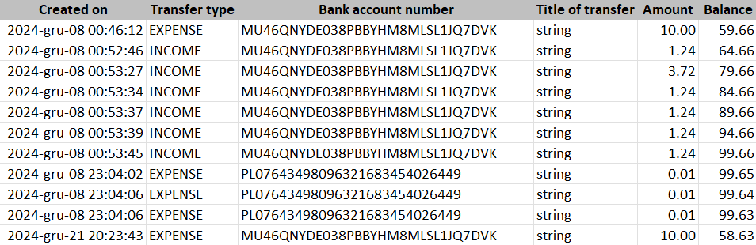
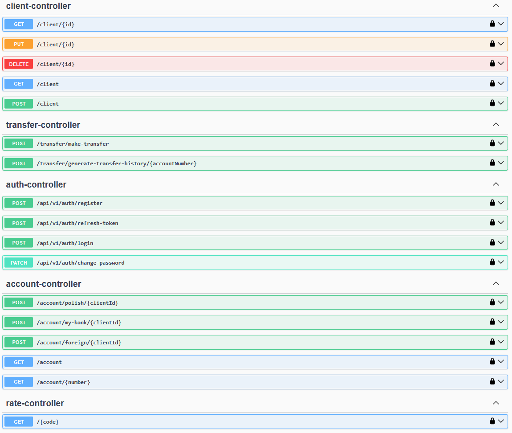

# bank-app *(MyBank)* 💸

%3D'project'%5D%2F*%5Blocal-name()%3D'properties'%5D%2F*%5Blocal-name()%3D'java.version'%5D&label=Java&color=orange)
%3D'project'%5D%2F*%5Blocal-name()%3D'parent'%5D%2F*%5Blocal-name()%3D'version'%5D&label=Spring%20Boot)


## Table of contents
- [Overview](#overview-)
- [Technology stack](#technology-stack-)
- [API Endpoints](#api-endpoints-)
- [Testing](#testing-)
- [Future Enhancements](#future-enhancements-)
- [License](#license-)
- [Contact](#contact-)

## Overview 📝
Welcome to the **MyBank** project.

MyBank is a REST-based application simulating a simple banking system. It provides basic functionalities
for managing user accounts and processing transactions. This project is under development.

Key features include:
* generation of valid IBAN bank account numbers (using the iban4j library)
* simulation of transfers in multiple currencies (with real-time exchange rates from the National Bank of Poland's API)
* generation of transfer history reports in xlsx format (powered by Apache POI)

For example for xlsx file *"Transfer history PL41587593093455485451756425"*:



## Technology stack 🚀
* Java
* Spring Boot
* Spring Security + JWT
* Hibernate + Spring Data JPA
* PostgreSQL / H2 (testing)
* Maven
* Lombok
* Apache POI
* Swagger (Open API)
* JUnit, Mockito, AssertJ
* JaCoCo

[Back to top](#table-of-contents)

## API endpoints 👈
Find all endpoints details [api-docs](http://localhost:8080/bank/swagger-ui.html) after running application



[Back to top](#table-of-contents)

## Testing ✔️
Unit and integration tests are written using **JUnit**, **Mockito**, and **AssertJ** to ensure code quality and reliability.

To run tests locally use the following command:
```sh
mvn test
```

#### Code Coverage
JaCoCo is used to measure test coverage. To generate a coverage report, run:

```sh
mvn clean verify
```

The report will be available in:

```
target/site/jacoco/index.html
```
[Back to top](#table-of-contents)

## Future Enhancements 🔮
Future updates will include new features.

[//]: # ([[Back]]&#40;#table-of-contents&#41;)

## License ⚖️
The *MyBank* application is licensed under the [Apache-2.0 license](https://www.apache.org/licenses/LICENSE-2.0)

## Contact 🙋‍♂️
* LinkedIn: [Marcin Wolniewicz](https://www.linkedin.com/in/marcin-wolniewicz-b9aa83165)

[Back to top](#table-of-contents)
